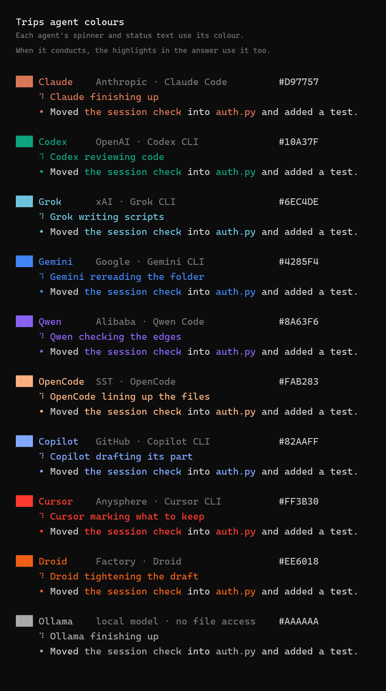

# Trips

**One conversation with three AI coding tools at once.**

Trips runs three AI command-line tools side by side on the project folder you are in. One of them is the *conductor*: it splits your request three ways, all three work at the same time, and the conductor combines their reports into the single answer you see.

<p align="center">
  
</p>

Trips does not include any AI and has no account of its own. It starts the tools you have already installed and signed in to, using your accounts.

---

## Contents

- [How it works](#how-it-works)
- [Requirements](#requirements)
- [Install](#install)
- [Quick start](#quick-start)
- [Supported agents](#supported-agents)
- [Using Trips](#using-trips)
- [What Trips does to your files](#what-trips-does-to-your-files)
- [Privacy and your keys](#privacy-and-your-keys)
- [Settings](#settings)
- [Troubleshooting](#troubleshooting)
- [Development](#development)
- [License](#license)

---

## How it works

Every request goes through three steps.

| Step | Who | What happens |
| --- | --- | --- |
| 1. Plan | Conductor | Reads the request and gives each of the three agents a different part of it. A file can belong to only one agent. |
| 2. Work | All three, at once | Each agent reads the project and sends back a short report, plus the full text of any file it was assigned. |
| 3. Answer | Conductor | Reads the three reports, decides which proposed files to accept, and writes one combined reply. |

You choose the conductor and the two other agents each time you start, and you can change them in the middle of a session.

---

## Requirements

- **Python 3.10 or newer.** Trips has no other Python dependencies.
- **At least three of the [supported agents](#supported-agents)**, each installed and signed in. Run each one on its own once first, so you know it works.
- **A terminal that shows colour and Unicode.** Windows Terminal, the VS Code terminal, iTerm2, and most Linux terminals are fine.

Trips is developed and tested on Windows. The macOS and Linux keyboard handling is written but has not been tested yet. Reports are welcome.

---

## Install

With [pipx](https://pipx.pypa.io) (recommended), which puts a `trips` command on your path:

```
pipx install git+https://github.com/Climax53/trips
```

Or with pip:

```
pip install git+https://github.com/Climax53/trips
```

Or run it from a clone, without installing anything:

```
git clone https://github.com/Climax53/trips
cd trips
python trips.py
```

On Windows, `Trips.ps1` in the clone does the same as `python trips.py`.

**To update:** `pipx upgrade trips-cli`. **To remove:** `pipx uninstall trips-cli`.

---

## Quick start

1. Check which agents Trips can find:

   ```
   trips doctor
   ```

   Installed tools are ticked. The others are listed with how to install them. Nothing is started and nothing is written.

2. Move into a project folder and start Trips:

   ```
   cd my-project
   trips
   ```

3. Choose the conductor, then two workers.

   ```
   ╭─ Team ───────────────────────────────────────────────── Step 1 of 2 ─╮
   │                                                                      │
   │  Choose the conductor                                                │
   │  The conductor plans the split and writes the one answer.            │
   │                                                                      │
   │  INSTALLED · 3                                                       │
   │  ❯ 1  ● Claude    Anthropic · Claude Code                            │
   │    2  ● Codex     OpenAI · Codex CLI                                 │
   │    3  ● Grok      xAI · Grok CLI                                     │
   │                                                                      │
   ├──────────────────────────────────────────────────────────────────────┤
   │  ↑↓ move   enter choose   1-9 pick by number                         │
   ╰──────────────────────────────────────────────────────────────────────╯
   ```

4. Type a request and press Enter.

   ```
   ╭─ Trips ──────────────────────────────────── ★ Claude · Codex · Grok ─╮
   │ › add a test for the expired-token path in the login handler         │
   ╰──────────────────────────────────────────────────────────────────────╯
     enter send · ↑ earlier requests · team · help · exit
   ```

Trips remembers your team, so the next start is Enter, Enter.

---

## Supported agents

| Name | Tool | Install |
| --- | --- | --- |
| `claude` | [Claude Code](https://www.anthropic.com/claude-code) (Anthropic) | `npm install -g @anthropic-ai/claude-code` |
| `codex` | [Codex CLI](https://github.com/openai/codex) (OpenAI) | `npm install -g @openai/codex` |
| `grok` | Grok CLI (xAI) | see x.ai |
| `gemini` | [Gemini CLI](https://github.com/google-gemini/gemini-cli) (Google) | `npm install -g @google/gemini-cli` |
| `qwen` | [Qwen Code](https://github.com/QwenLM/qwen-code) | `npm install -g @qwen-code/qwen-code` |
| `opencode` | [OpenCode](https://opencode.ai) | `npm install -g opencode-ai` |
| `copilot` | GitHub Copilot CLI | `npm install -g @github/copilot` |
| `cursor` | Cursor CLI (`cursor-agent`) | see cursor.com/cli |
| `droid` | Factory Droid | see factory.ai |
| `ollama` | A local [Ollama](https://ollama.com) model | see ollama.com |

Claude Code, Codex, and Grok are the ones Trips has been used with most. If another tool does not start, its command can be corrected in your [settings](#settings) without changing any code, and a fix sent as a pull request helps everyone.

Two notes:

- **Ollama** needs a model name in your settings before it can be chosen, and a local model cannot open your files. It can only reason about what the request says.
- You can **add a tool that is not listed**. See [Adding or changing an agent](#adding-or-changing-an-agent).

Each agent has its own colour. Its spinner and status text use that colour, and when it conducts, the headings, bold text, code, and bullets in the answer use it too.



---

## Using Trips

### The team screen

| Key | Step 1: conductor | Step 2: workers |
| --- | --- | --- |
| `↑` `↓` | move | move |
| `Enter` | choose the highlighted agent | start, once two are chosen |
| `Space` | | add or remove the highlighted agent |
| `1` to `9`, `0` | choose that agent | add or remove that agent |
| `Esc` | | go back to step 1 |

Agents that are not installed are listed separately. Choosing one shows how to install it.

### The request box

Type a request and press Enter. Long text wraps inside the box. Pasted text that contains line breaks stays as one request.

| Key | What it does |
| --- | --- |
| `Enter` | send |
| `↑` `↓` | bring back earlier requests from this session |
| `←` `→` `Home` `End` | move within the text |
| `Esc` | clear the box |
| `Ctrl+C` | leave, or stop a request that is running |

These words are commands when typed alone in the box:

| Command | What it does |
| --- | --- |
| `team` | choose a different conductor or different workers |
| `clean` | delete saved job notes (the conversation is kept) |
| `help` | list these commands |
| `exit` | leave |

### While a request runs

The status line shows what stage the request is in. During the work stage, a tick appears beside each agent when its report has actually come back. The answer is printed under a rule that names the team and how long the request took.

### One request, no screens

```
trips "describe the change you want"
trips --conductor gemini --with claude,codex "describe the change"
trips --last "use the same team as last time"
```

| Option | Meaning |
| --- | --- |
| `--conductor NAME` | who plans and writes the answer |
| `--with A,B` | the two other agents |
| `--last` | use the remembered team without asking |
| `--project PATH` | work on a folder other than the current one |
| `--here` | do not ask before using a folder outside your trusted folders |
| `--doctor` | check the setup and exit |

For scripts, the environment variables `TRIPS_CONDUCTOR` and `TRIPS_WITH` do the same as `--conductor` and `--with`.

---

## What Trips does to your files

Trips does not copy your project, and does not create a second folder anywhere else on the disk.

- **Agents read. Trips writes.** Each agent is started in its read-only or no-edit mode. An agent proposes the full text of a file, and Trips writes it.
- **Three checks before a write.** A file is written only when it was assigned to that agent in the plan, the conductor accepted it, and its path is inside the project.
- **A backup of anything replaced.** Before Trips overwrites a file, the old version is saved under `.trips/jobs/<job>/previous/`.
- **A check for surprises.** Trips records the state of the project before the agents run and compares it afterwards. If any file changed that Trips did not write, none of the proposals are written, and the unexpected file is named in the answer and left alone. This is what catches a tool whose read-only mode did not hold.

Trips keeps its notes in a `.trips` folder inside the project:

| Path | Contents |
| --- | --- |
| `.trips/conversation.jsonl` | your requests and the answers, so later requests have context |
| `.trips/jobs/<job>/` | the plan, each agent's report, the answer, and backups, for the newest request only |

When the project is a git repository, `.trips/` is added to its `.gitignore`. The `clean` command deletes the job notes.

**Limits to know about.** Trips can detect an unexpected change, but it does not keep a full copy of your project and cannot undo one. Commit your work before a large request. The agents also keep their own session logs in their own home folders, as they do when you run them yourself.

---

## Privacy and your keys

What Trips itself does:

- **It makes no network connections.** There is no networking code in Trips, no telemetry, and no update check. You can confirm this by searching the source in `src/trips_tool`.
- **It never reads, stores, or prints your API keys or sign-ins.** Each agent uses its own sign-in exactly as it does when you run it yourself. Trips does not handle the credentials at all.
- **It keeps your settings on your computer**, in `~/.trips/config.json`. That file holds your team choice and preferences, and no credentials.
- **Nothing about your computer is in this repository.** The code contains no usernames, paths, or keys.

What the agents do:

- The three tools you choose **do** send your request, and the parts of your project they read, to their own providers. That is how they work, with or without Trips. What you send through Trips is covered by each provider's terms and privacy settings, the same as when you use the tool directly.
- Each agent is started with the same environment variables your terminal has. To hide a variable from them, list it under `strip_env` in your settings.

---

## Settings

Settings are optional. They live in `~/.trips/config.json` (on Windows, `C:\Users\<you>\.trips\config.json`). Set the `TRIPS_CONFIG` environment variable to use a different file. The file is created the first time you choose a team.

```json
{
  "conductor": "claude",
  "workers": ["codex", "gemini"],
  "logo": "medium",
  "worker_timeout_minutes": 20,
  "history_turns": 6,
  "strip_env": [],
  "trusted_folders": [],
  "agents": {}
}
```

| Setting | Default | Meaning |
| --- | --- | --- |
| `conductor` | `"claude"` | The conductor offered first. Updated when you choose a team. |
| `workers` | `["codex", "grok"]` | The two workers offered first. Updated when you choose a team. |
| `logo` | `"medium"` | The opening picture: `"off"`, `"small"`, `"medium"`, or `"large"`. |
| `worker_timeout_minutes` | `20` | How long one agent may run before it is stopped. |
| `history_turns` | `6` | How many earlier turns of the conversation the conductor is shown. |
| `strip_env` | `[]` | Environment variables to hide from the agents. For example, list `ANTHROPIC_API_KEY` to make Claude Code use its own sign-in and not bill that key. |
| `trusted_folders` | `[]` | When set, Trips asks before working in a folder outside these. |
| `agents` | `{}` | Changes to the built-in agents, or agents of your own. |

### Adding or changing an agent

Entries under `agents` change a built-in agent or add a new one.

```json
{
  "agents": {
    "claude": { "model": "sonnet" },
    "ollama": { "model": "llama3.2" },
    "mytool": {
      "label": "My Tool",
      "command": ["mytool", "--read-only", "--prompt-file", "{prompt_file}"]
    }
  }
}
```

| Field | Meaning |
| --- | --- |
| `model` | The model that tool should use. |
| `label` | The name shown on screen. |
| `command` | The whole command line, as a list. The first item is the program. |
| `stdin` | `true` to send the instructions on standard input. Worked out from the command when left out. |

Inside `command`, these placeholders are filled in:

| Placeholder | Becomes |
| --- | --- |
| `{prompt_file}` | the path of a file holding the instructions |
| `{prompt_ref}` | a one-line instruction telling the tool to read that file |
| `{project}` | the project folder |
| `{model}` | the `model` value |

A command with no `{prompt_file}` or `{prompt_ref}` receives the instructions on standard input. Whatever the tool prints is read as its reply. For the safety checks to mean anything, give the tool whatever option makes it read-only.

To point Trips at one specific executable, set `TRIPS_CLAUDE`, `TRIPS_CODEX`, and so on to its path.

---

## Troubleshooting

| Problem | What to do |
| --- | --- |
| "Trips needs three AI tools installed" | Run `trips doctor`. Install and sign in to more of the listed tools until three are ticked. |
| An agent is listed as not installed, but you have it | Its command must be on your path. Open a new terminal and try running it by name. Or set `TRIPS_<NAME>` to the full path of its executable. |
| "The conductor could not write a plan" | The message after it comes from the tool itself, for example a usage limit or an expired sign-in. Run that tool on its own to see the full error, or type `team` and choose another conductor. |
| An agent's report says it did not finish | The other two still count and you still get an answer. Run the failed tool on its own to find out why. |
| An agent fails only inside Trips | If you rely on an API key in an environment variable, check that it is not listed under `strip_env`. |
| The picture or box characters look broken | Use a terminal and font with Unicode support, such as Windows Terminal with Cascadia Mono. Set `"logo": "off"` to hide the picture. |
| No colours | Colour is used only when Trips is writing to a terminal, not when its output is sent to a file or another program. |
| "Trips is already running in this folder" | Close the other Trips window. If there is none, delete `.trips/trips.lock`. |

---

## Development

```
git clone https://github.com/Climax53/trips
cd trips
python -m unittest discover -s tests
```

The tests do not call any AI. Setting `TRIPS_FAKE=1` runs the whole flow with a stand-in in place of the real tools, which is useful when changing the screens.

| Path | Contents |
| --- | --- |
| `src/trips_tool/roster.py` | the list of agents and how each one is started |
| `src/trips_tool/orchestrator.py` | the plan, work, and answer steps |
| `src/trips_tool/plan.py`, `safety.py` | the checks on plans, proposals, and paths |
| `src/trips_tool/picker.py`, `inputbox.py`, `display.py`, `logo.py` | the screens |
| `tools/make_logo.py` | rebuilds the opening picture from an image (needs Pillow) |

The most useful contribution is running Trips with an agent other than Claude Code, Codex, or Grok and reporting how it went.

---

## License

[MIT](LICENSE)
